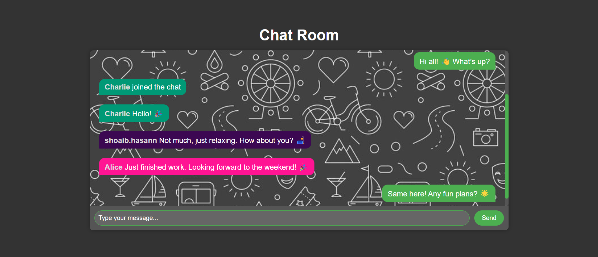
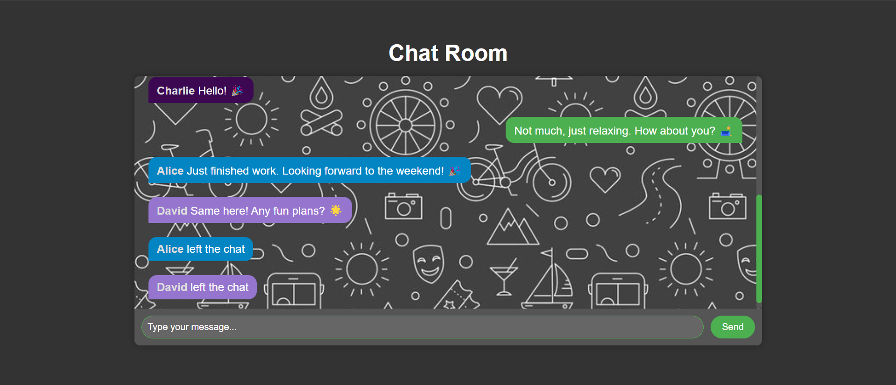

# 💬 Chat Application

Welcome to the Chat Application! This project is a real-time chat app built using Node.js, Express, Socket.IO, and vanilla JavaScript. It features a dark-themed UI and allows users to join a chat room, send and receive messages, and see notifications when users join or leave the chat.

## 🌐 Live Preview

Checkout Live Preview by clicking the image below:

[](https://threads-clone-two-pink.vercel.app/)

[](https://threads-clone-two-pink.vercel.app/)


## Tech Stack

- **Frontend:**
  - Vite Vanilla JS Project
  - socket.io-client (for connecting to websocket server)

- **Backend:**
  - socket.io (for websockets)
  - dotenv (for enviroment variables)
  - nodemon (for development server)
  - express (for handling HTTP requests)

## Features

- Real-time messaging with Socket.IO
- User notifications for joining and leaving the chat
- Dark-themed UI with responsive design
- Support for multiple users in a chat room
- Dynamic message display with animations

## Technologies Used

- **Frontend**: HTML, CSS, JavaScript
- **Backend**: Node.js, Express, Socket.IO
- **Styling**: CSS for a dark-themed UI
- **Development Tools**: Vite for frontend build tool

## Getting Started

To get started with the chat application, follow these steps:

### Prerequisites

- Node.js and npm installed on your machine

### Installation

1. Clone the repository:

   ```bash
   git clone https://github.com/yourusername/chat-app.git
   cd chat-app

2. Install Backend dependencies:

   ```bash
   cd server
   npm install

3. Install Frontend dependencies:
   ```bash
   cd ../client
   npm install

4. Create a `.env` file in the server directory with the following content:
   ```bash
   PORT=9000
   CLIENT_URL=http://localhost:3000

5. Start the backend server
   ```bash
   cd server
   npm start 

6. Start the fronend server
   ```bash
   cd ../client
   npm run dev

## Usage

1. Open your browser and go to http://localhost:3000.
2. Enter a username and click "Join" button.
3. Start sending messages and see real-time updates.


## Contributing

Contributions are welcome! Please follow these steps:


## Acknowledgments
Inspired by various real-time chat applications
Uses Socket.IO for real-time communication
Styled with CSS for a dark-themed UI

**Feel free to adjust any details to better match your project.**