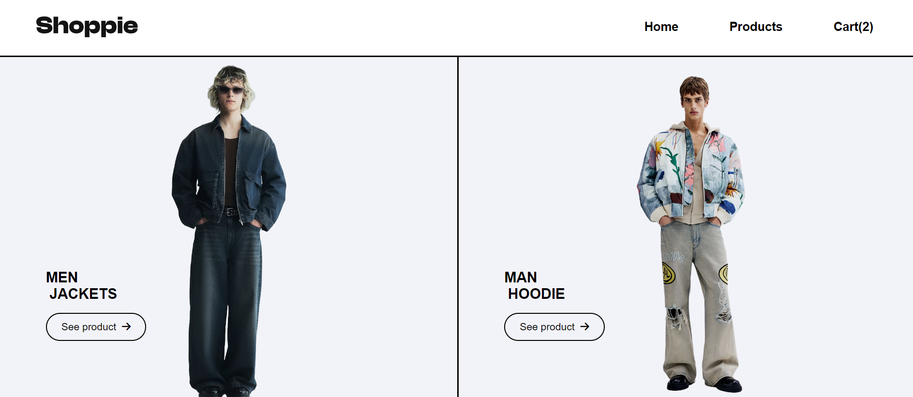
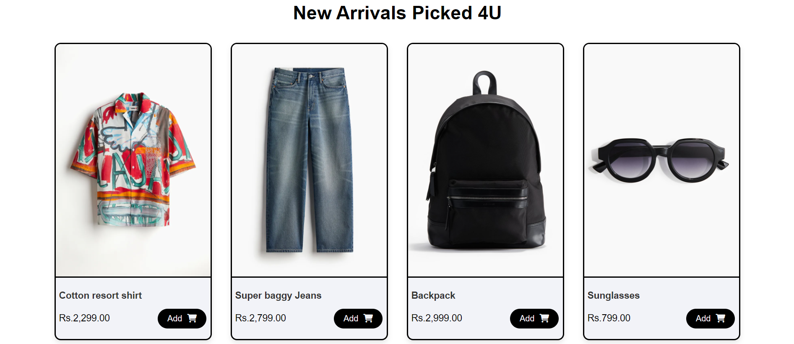
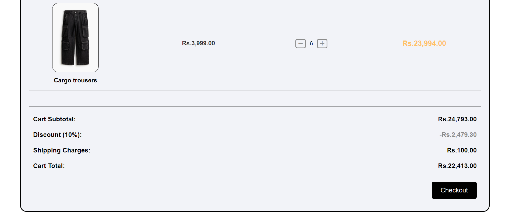

# Shoppie Ecommerce Website

Shoppie is designed as a Single Page Application (SPA), ensuring a smooth and seamless user experience. The website dynamically renders pages using JavaScript, meaning that when users navigate between different sections—such as the product listings, cart, checkout, and order confirmation—only the relevant content is updated without reloading the entire page. This approach provides faster interactions and a more fluid experience, making the website feel more responsive and intuitive. Each page transition is handled efficiently, ensuring that users can shop, review their cart, and complete their purchase with minimal interruption.

## 📸 App Screenshots

### Home Page


### Products Section


### Cart Page



## 🌟 Features

- **Single Page Application (SPA)**: All pages are rendered dynamically using JavaScript, providing a seamless and interactive user experience.

- **Products Section**: Users can browse products, add them to the cart, and see all relevant product details.

- **Cart Page**: Users can increase, decrease the quantity of items, or remove items from the cart.

- **Checkout Page**: Includes a form for user information and order details.

- **Order Confirmation Page**: Displays a summary of the user's order after checkout.

## 📂 Project Structure

- `index.html`: The main HTML file that contains the structure of the app.

- `styles.css`: The CSS file that provides the styling for the app.
- `main.js`: The main entry point for the JavaScript functionality.
- `hooks.js`: Contains utility functions like `formatToRupees`.
- `navigation.js`: Handles rendering of different pages.
- `cart.js`: Manages cart-related functionality.

## 🚀 How to Use

1. **Clone the repository**:
    ```bash
    git clone https://github.com/shoaibhasann/30-days-challenge.git
    ```

2. **Navigate to the project folder**:
    ```bash
    cd e-commerce
    ```

3. **Install dependencies**:
    ```bash
    npm install
    ```

4. **Run the development server**:
    ```bash
    npm run dev
    ```

5. **Open in your browser**:
    Open `http://localhost:5173` in your browser to start using the app.

## ✏️ Customization

You can easily customize the appearance of the app by modifying the `styles.css` file. If you want to change the behavior or add new features, you can edit the relevant JavaScript files (`main.js`, `hooks.js`, `navigation.js`, `cart.js`).


## 🛠 Acknowledgments

- Icons used in this project are from [Font Awesome](https://fontawesome.com/).
