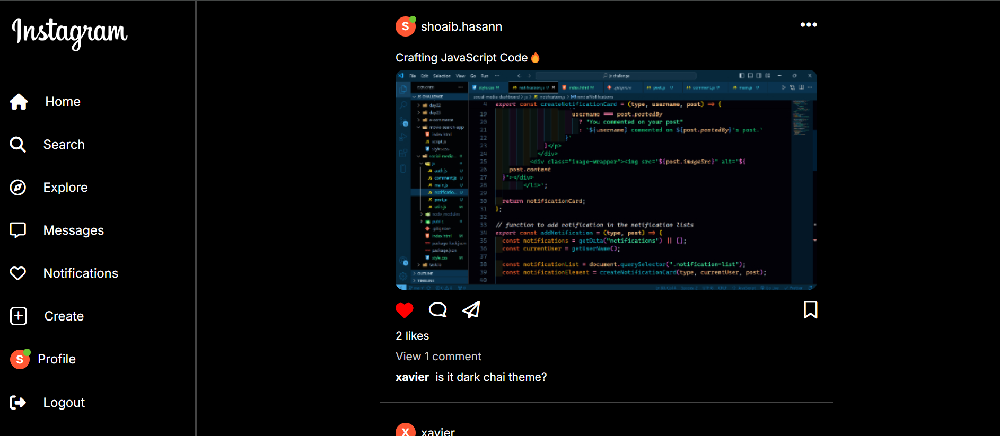
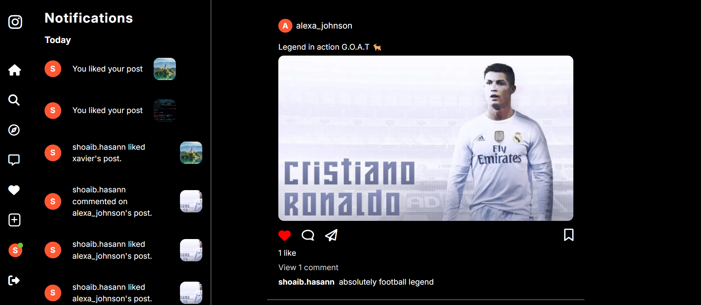

# [Instagram Clone](https://instagram-clone-sage-tau.vercel.app/)

This project is a social media application inspired by Instagram, created using pure Vanilla JavaScript, HTML, and CSS. It mimics several key features of Instagram, including user authentication, post management, real-time notifications, and a UI inspired by Instagram's dark theme. The application is a Single Page Application (SPA) that dynamically renders content, providing a seamless and responsive experience across all device sizes.

## 📸 App Screenshots

click on image to get live preview 🌐

### Home Page
[](https://instagram-clone-sage-tau.vercel.app/)


[](https://instagram-clone-sage-tau.vercel.app/)


## 🌟 Features

### 1. User Authentication
- **Login and Signup**: Users can sign up with a username, email, and password, or log in with their credentials. Authentication data is stored in `localStorage`.

- **Status Indicator**: A green dot is displayed next to the profile icon of active (logged-in) users.

### 2. Post Management (CRUD Operations)
- **Create Posts**: Users can create new posts, including both text and images.

- **Read Posts**: Users can view posts created by themselves and others.

- **Update Posts**: Users can edit their posts.

- **Delete Posts**: Users can delete their own posts.

- **Responsive Design**: The application is fully responsive, adjusting seamlessly to various device sizes.

### 3. Interaction Features

- **Like and Dislike Posts**: Users can like or dislike posts. The like count is updated in real-time.

- **Comment on Posts**: Users can add comments to posts. Comments are dynamically displayed.

- **Notifications**: A notification system mimics real-time updates when a user likes or comments on a post.

### 4. Single Page Application (SPA)

- The entire application operates as a Single Page Application (SPA), rendering different views and components dynamically using Vanilla JavaScript without reloading the page.`

### 5. Data Storage

- All data, including user profiles, posts, comments, likes, and notifications, are stored locally in the browser using localStorage. This ensures data persistence across sessions.

## UI Design

- **Dark Theme**: The UI is inspired by Instagram's dark theme, providing a sleek, modern, and user-friendly interface.

- **Profile Icons**: Profile icons display the first character of the username, with an active status indicator (green dot) for logged-in users.

## 📂 Project Structure

- `index.html`: The main HTML file that contains the structure of the app.

- `style.css`: The CSS file that provides the styling for the app.

- `main.js`: The main entry point for the JavaScript functionality.

- `auth.js`: Handles Authentication.

- `post.js`: Manages CRUD Operations for posts.

- `utils.js`: Contains utility functions like `compressImage` used across the application.

- `notification.js`: Handles notifications for likes and comments.

- `comment.js`: Manages comment functionality.

## 🚀 Getting Started

### Prerequisties

- **Make sure you have `Node.js` installed.**

### Installation

1. **Clone the repository**:
    ```bash
    git clone https://github.com/shoaibhasann/30-days-challenge.git
    ```

2. **Navigate to the project folder**:
    ```bash
    cd social-media-dashboard
    ```

3. **Install dependencies**:
    ```bash
    npm install
    ```

4. **Run the development server**:
    ```bash
    npm run dev
    ```

5. **Open in your browser**:
    Open `http://localhost:5173` in your browser to start using the app.


## Usage

- **Sign Up**: Create a new account by providing a username, email, and password.

- **Log In**: Log in using your credentials to access the application.

- **Create Posts**: Add a new post by clicking the "Create Post" button. You can add text and an image.**

- **Interact with Posts**: Like, comment, edit, or delete posts directly from the feed.

- **Notifications**: View notifications for likes and comments on your posts.

## ✏️ Customization

You can easily customize the appearance of the app by modifying the `style.css` file. If you want to change the behavior or add new features, you can edit the relevant JavaScript files (`main.js`, `post.js`, `notification.js`, `comment.js`, `auth.js`, `utils.js`) present in the `js` folder in root directory.


## 🛠 Acknowledgments

- Icons used in this project are from [Font Awesome](https://fontawesome.com/).
