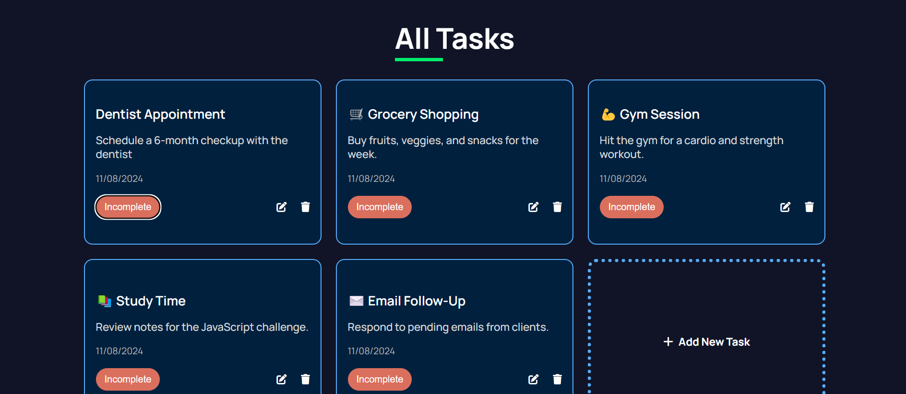
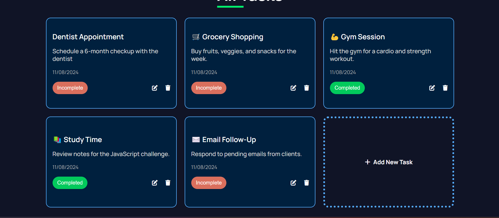

# 📝 task.io

This is a simple Task Management application built with HTML, CSS, and JavaScript. The app allows users to view, add, edit, delete, and mark tasks as completed. Tasks are stored in the browser's `localStorage`, so they persist even after the page is reloaded.

## App Screenshots 🔥






## 🌟 Features

- **Add New Task**: Users can add a new task with a title and description.
- **Edit Task**: Users can edit an existing task's title and description.
- **Delete Task**: Users can delete a task.
- **Mark Task as Complete/Incomplete**: Users can toggle a task's status between complete and incomplete.
- **Persist Data**: All tasks are stored in `localStorage`, so they persist across page reloads.

## Project Structure

- `index.html`: The main HTML file that contains the structure of the app.
- `styles.css`: The CSS file that provides the styling for the app.
- `script.js`: The JavaScript file that contains the logic for managing tasks.

## How to Use

1. **Clone the repository**:
    ```bash
    git clone https://github.com/shoaibhasann/30-days-challenge.git
    ```

2. **Navigate to Project folder**:

    ```bash
    cd task.io
    ```

3. **Open `index.html`**:
    Simply open the `index.html` file in your browser to start using the app.

4. **Adding a Task**:
    - Click on the "Add New Task" button.
    - Fill in the task title and description.
    - Click "Submit" to add the task.

5. **Editing a Task**:
    - Click the pencil icon on the task you want to edit.
    - Modify the title and description in the modal that appears.
    - Click "Submit" to save the changes.

5. **Deleting a Task**:
    - Click the trash icon on the task you want to delete.
    - The task will be removed from the list.

6. **Marking a Task as Complete/Incomplete**:
    - Click the "Complete" or "Incomplete" button on the task to toggle its status.

## ✏️ Customization

You can easily customize the appearance of the app by modifying the `styles.css` file. If you want to change the behavior or add new features, you can edit the `script.js` file.


## Acknowledgments

- Icons used in this project are from [Font Awesome](https://fontawesome.com/).
