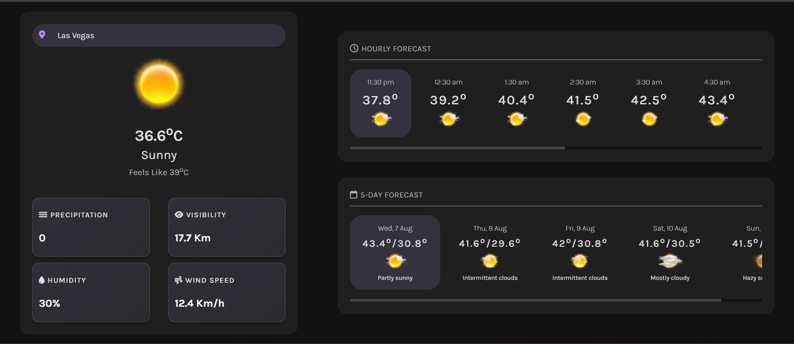

# weather.io

**weather.io** is a modern weather forecasting website that provides users with precise weather information for any city around the world. Built using HTML, CSS, and vanilla JavaScript, this project leverages the AccuWeather API to deliver current weather, 12-hour forecasts, and 5-day forecasts.

## 🌐 Live Preview

Checkout Live Preview by clicking the image below:

[](https://threads-clone-two-pink.vercel.app/)


## Features

- **Global Weather Lookup:** Users can check the weather for any city in the world.
- **Current Weather:** Get up-to-date information on temperature, weather conditions, humidity, visibility, and wind speed.
- **12-Hour Forecast:** View detailed weather forecasts for the next 12 hours.
- **5-Day Forecast:** Receive weather forecasts for the next 5 days, including temperature highs and lows.
- **Search Suggestions:** Enhanced search functionality with autocomplete suggestions powered by the AccuWeather Autocomplete Search API.
- **Responsive Design:** A visually appealing dark theme with a responsive layout ensures a great experience on both desktop and mobile devices.


## 💻 Technologies Used

- **HTML** - Structure of the website
- **CSS** - Styling and design
- **JavaScript** - Interactivity and API integration
- **AccuWeather API** - Source of weather data
- **AccuWeather Autocomplete Search API** - Search suggestion functionality

## 🔽 Installation

1. **Clone the repository:**

    ```bash
    git clone https://github.com/shoaibhasann/30-days-challenge.git
    ```

2. **Navigate to the project directory:**

    ```bash
    cd weather-app
    ```

3. **Install the dependencies:**

    ```bash
    npm install
    ```

4. **Create a `.env` file in the root of the project and add your API key:**

    ```plaintext
    VITE_ACCUWEATHER_API_KEY=your-actual-api-key
    ```

5. **Start the development server:**

    ```bash
    npm run dev
    ```

6. **Open your browser and navigate to the local development server

    ```bash
    open http://localhost:5173/
    ```

## Usage

1. **Enter a city name** in the search bar.
2. **View search suggestions** as you type, powered by the AccuWeather Autocomplete Search API.
3. **Select a city** from the suggestions to get the current weather, 12-hour forecast, and 5-day forecast.
4. **Explore the weather details** and enjoy the responsive dark-themed UI.

## 🗝️ API Keys

- **AccuWeather API Key:** You need a valid API key from AccuWeather to access weather data. Replace the placeholder `apiKey` in the `./js/api.js` file with your actual API key.
- **Autocomplete Search API Key:** Make sure you use the correct API key for accessing the autocomplete search functionality.

## Contributing

Feel free to fork the repository and submit pull requests. For bug reports or feature requests, please open an issue in the repository.

## License

This project is licensed under the [MIT License](LICENSE).

## Acknowledgements

- [AccuWeather API](https://developer.accuweather.com/) for weather data.
- [AccuWeather Autocomplete Search API](https://developer.accuweather.com/apis) for search suggestions functionality.

---

Enjoy exploring weather.io, and feel free to reach out if you have any questions or feedback!
